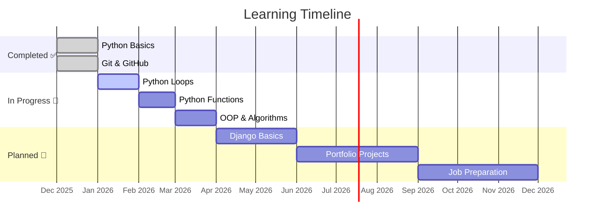

### 👋 Hello, I'm Ivan!

I'm on a journey to become a Python/Django developer, learning in public.

## 🚀 Current Project
**[python_learning_journey](https://github.com/gen-comf/python_learning_journey)** - My structured learning path from Python basics to web development.

## 📊 Current Progress
- ✅ Git & GitHub setup completed
- ✅ Python basics: variables, conditionals, data types  
- 🔄 Learning: loops and functions
- ⏳ Next: Django for web development

## 🛠️ Tech Stack

## 📈 GitHub Stats

## 🎯 2026 Goals
1. Complete "Поколение Python" course
2. Build first Django project
3. Create developer portfolio
4. Contribute to open source

## 📫 Connect
- GitHub: [@gen-comf](https://github.com/gen-comf)
- Learning in public, one commit at a time!
